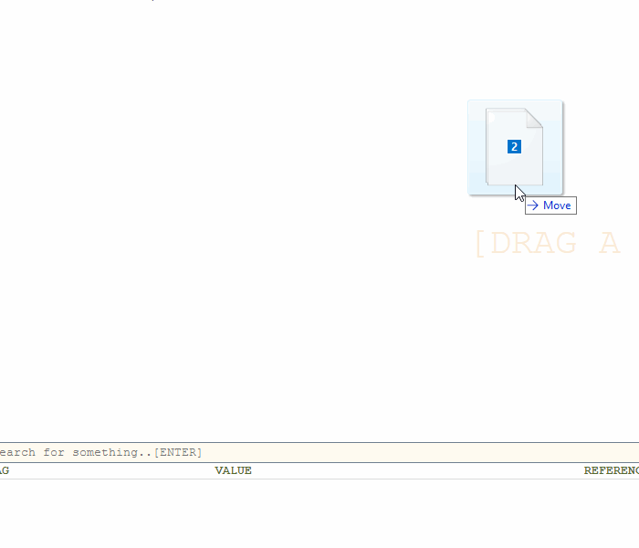
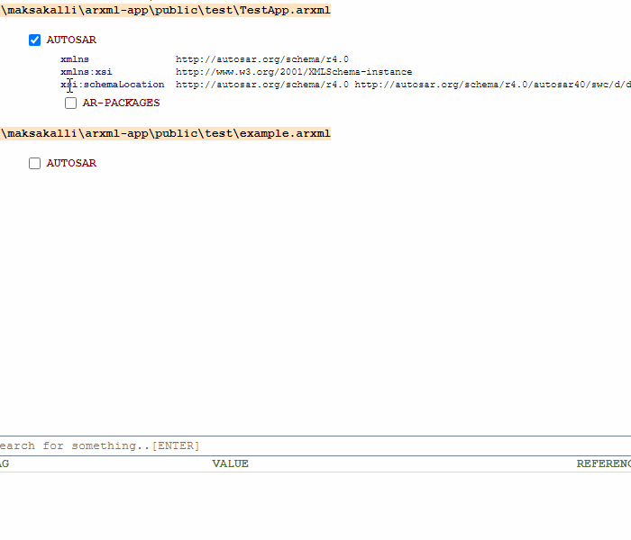
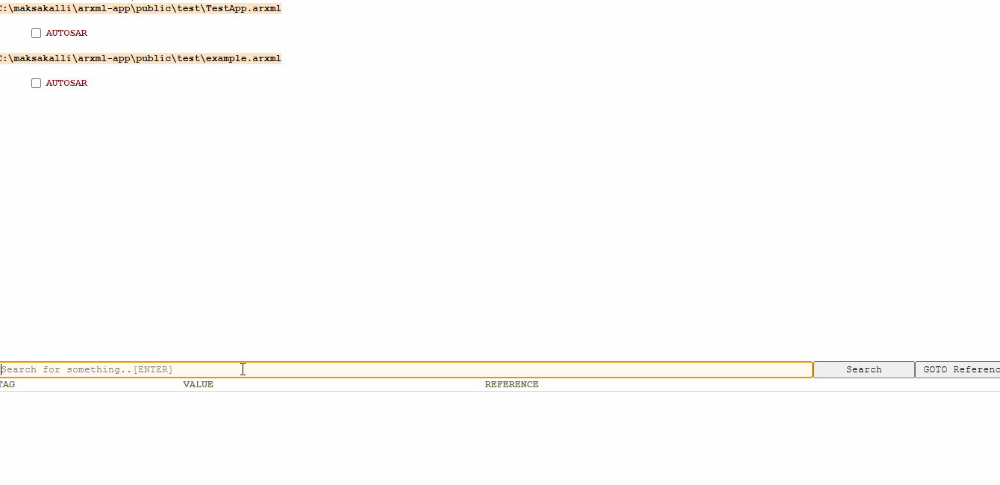

# arxml-app
<p align="center">
    
</p>
This tool aims to visualize ARXML files in human readable form with easy search operations.

## Features
* open ARXML files up to 500MB
* Drag-drop file operations
* Multiple file support

    

* Easy usage

    

* Advanced search functionalities

    

## Executables
* [win_x64_setup](./dist/arxmlviewer_setup_win_x64.exe)

## Development
* [ElectronJS](https://www.electronjs.org/)
    * creates Desktop applications 
    * handles file operations
* [VueJS](https://vuejs.org/)
* [fast-xml-parser](https://www.npmjs.com/package/fast-xml-parser)
    * Parse XML to JS/JSON  
* [traverse](https://www.npmjs.com/package/traverse)
    * Traverse and transform objects by visiting every node on a recursive walk.

## Project setup
```
npm install
```

### Compiles and hot-reloads for development
```
npm run electron:serve
```

### Compiles and minifies for production
```
npm run electron:build
```

### Customize configuration
See [Configuration Reference](https://cli.vuejs.org/config/).

## Upcoming Features
* ARXML file support > 500MB
* ECU view to visualize SWCs, runnables and port connections
